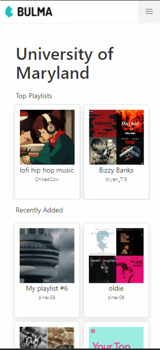

# Kickback 

An environment for you to discover different music cultures from different unviersities. Discover what other students listen to. 


## Table of Contents 
* [Demo](#Demo)
* [Developers](#Developers)
* [Dependencies](#Dependencies)
* [Features](#Features)
* [Examples](#Examples)


## Demo 

<p align="center">
 
</p>


To view more examples with code blocks go to [Examples](#Examples)</br>
For a live demo feel free to contact me [andy.pinedar@gmail.com](mailto:andy.pinedar@gmail.com)

## Developers

### Andy Pineda 
Hi my name is [Andy Pineda](https://www.linkedin.com/in/andy-pineda/), I'm a senior studying Information Science at the University of Maryland graduting May 2021. I'm pursing a career in software engineering and 
enjoy developing my own projects on my free time. I focused on developing the full stack application from working on the front end to engineering the database and createing the api routes to access data from the database. 

### Sydney Bullock
My partner [Sydney Bullock](https://www.linkedin.com/in/sydney-bullock/) is a senior studying Journalism at the University of Maryland graduating July 2021 focused on Product Development and Marketing. 
Sydney focused on marketing and branding the product. Sydney helped guide the design proccess helping make alterations to the application and deciding what features we should foucs on 
based off our own research and understanding. 


## Dependencies
Following a methodology of building fast and breaking things. Our goal is to be able to get an up and running Kickback as soon as possible. In order to do that we rely on some notable dependencies for styling, authentication and email services. As the application develops the goal will be to improve based off user feedback and slowly remove dependencies.

* @material-ui/core@4.11.2
* @material-ui/lab@4.0.0-alpha.57
* @prisma/cli@2.15.0
* @prisma/client@2.14.0
* @sendgrid/mail@7.4.2
* @types/node@14.14.20
* @types/react@17.0.0
* and@0.0.3
* bulma@0.9.1
* next@10.0.4
* next-auth@3.1.0
* react@17.0.1
* react-dom@16.13.1
* spotify-web-api-node@5.0.0
* superagent@6.1.0
* typescript@4.1.3


## Features 

### School Verification 
* Verify each school email through our database 
* Recieve a confirmation link using [SendGrid](https://github.com/sendgrid/sendgrid-nodejs)
* Assign a school to a users profile

### Intergration with Spotify API to 
* Access user playlist information 
* Unfollow/Follow users 
* Add/Remove Playlist from user library 
* Play/Pause Tracks 

### Discover universities  
* Acceess to a growing network of schools 
* Find verified users that are apart of different university 
* See what playlist are trending at each university and region


### Ranking 
* See what playlist are top in each region 
* See what playlist are trending at your school 
* Only aplpications that are trending in kickback are ranked 


### Secure 
*  Use [NextAuth](https://github.com/nextauthjs/next-auth/blob/main/README.md) to provide passwordless login and extra security
*  Protected API routes using [NextAuth](https://github.com/nextauthjs/next-auth/blob/main/README.md) session and .env screat key
*  All request to Spotify are protected with oAuth 


## Examples 
Able to share, stream and add music you discover. 
</br>
More examples will be added in the near feature. If you'd like to view more or get a live demo contact me [andy.pinedar@gmail.com](mailto:andy.pinedar@gmail.com)


<details>

<summary> Select Your School </summary> 
<p align="center">
 
</p>

1.First we load the data at build time by using getStaticProps from Nextjs. This allows us to get the list of schools 
and pass them to our React component as a prop. 


```javascript
// pages/index.js 

export async function getStaticProps(context) {

//Make a database request to get all the schools 
const school = await schools()
const colleges = school.schools


if (colleges != null){

    return {
    props: {colleges,...}, // will be passed to the page component as props
    }

}else{

    const colleges =  { name: 'Error Loading Schools' };
    return{
    props:{colleges}
    }
}
}


```


2. We use the imported school function to make a query to our database and to select all 
school and return it into the proper json structure required by Nextjs. 

```javascript 

// lib/db/prisma

export async function schools() {


    //Make a database request to get all the schools 
    const getSchool = await prisma.$queryRaw`SELECT * FROM kickback.schools;`
    .catch(e => {
        throw e
    })
    .finally(async () => {
        await prisma.$disconnect()
    })        

    
    return {
        schools:getSchool
    }


}

```

3.  We pass the schools as a prop to our Home compoenent and then pass it to our Navbar component as a parm for list of schools.  

```javascript 
function Home({colleges, ...}) {
return (
    <>
    <Head>
        ...
        <title>Kickback</title>
        ...
    </Head>


    <body>
        <Navbar listOfSchools={colleges}/>
        ...
    </body>
    </>
)
}


```


4. Using Material UI to display an autocomplete box by passing in the list of school props to the options parameter. 

```javascript 
    // components/navbar.js  


    <Autocomplete
    id="combo-box-demo"
    disableClearable
    options={listOfSchools}
    getOptionLabel={(option) => option.name}
    style={{ width: 300 }}
    renderInput={(params) => <TextField {...params} label="Search" variant="outlined" />}
    onChange={(event, value) => setSchoolChoice(value.name)}
    />
    
    <div className="block" style={{marginTop:"4em"}}>
        <p className=""> Enter your school email </p>
        <input required className="input is-info block" type="email" placeholder="ex firstlast@name.uni.edu" onChange={event => setSchoolEmail(event.target.value)}></input>
    </div>


```


</details>


<details>

<summary> Login </summary> 


<p align="center">
 
</p>


1. First we set up our NextAuth configuartion to allow Spotify logins in our application


```javascript
// pages/api/auth/[...nextauth].js

// For more information on each option (and a full list of options) go to
// https://next-auth.js.org/configuration/options
const options = {
  // https://next-auth.js.org/configuration/providers
  providers: [
    Providers.Spotify({
        clientId: process.env.SPOTIFY_CLIENT_ID,
        clientSecret: process.env.SPOTIFY_CLIENT_SECRET,
        scope: 'scopes',
        accessTokenUrl: 'https://accounts.spotify.com/api/token',
        profile(profile) {
          return {
            id: profile.id,
            name: profile.display_name,
            email: profile.email,
            image: profile.images?.[0]?.url,
            uri: profile.uri,
            link: profile.href,
            country: profile.country,
            
          }
        },

    })
  ],

  adapter: Adapters.Prisma.Adapter({ prisma }),


}


```


2.  We now use the NextAuth getSession to create a React state that then allows us to see if the user is logged in or not. 
Bellow we decide whether to display the connect button or user options depending on whether the user is logged in or not. 

```javascript 
// components/navbar.js 


{/* If the user is not Logged in  */}
{!session && 

    <button className="button is-primary" onClick={() => {isHidden(!isShown);}}>
        <strong>Connect</strong>
    </button>

}


{/* If the user is logged in */}
{session &&

    <>	
    {/* If the user school email is not verified then show the add school button */}
    {!isVerified && 

        <button className="button is-primary" onClick={() => {isHidingSchool(!isShowingSchool);}}>
        <strong>Add School</strong>
        </button>

    }
    


    {/* If the user school email is verified then show a custom button with a href link to their school page */}
    {isVerified && 
        <>
            <Link href='http://localhost:3000/schools/University-of-Maryland'>
                <button className="button is-light">
                    <span className="icon">
                        <i className="fas fa-graduation-cap"></i>
                    </span>
                    <span>{session.user.school}</span>
                </button>
            </Link>
            
            <button className="button is-success" onClick={() => {setPlaylists(!isShowingPlaylists);}}>
                <p>Add a Playlist</p>
            </button>
        </>
    }

    <button className="button is-warning" onClick={signOut}>
        <strong>Sign Out</strong>
    </button>

</>
}

```


3. If the user clicks connect then change the React state isShown to true to display the modal popup that provides the login instructions 

* Create a react state to trigger when to show the pop up 
``` javascript 
//components/navbar 

//Show modal card to connect to provider 
const [isShown, isHidden] = React.useState(false);

```

* Display the pop up to send you to the spotify login from nextAuth 
```javascript 

// components/navbar 
<div className={`modal ${isShown ? "is-active" : ""}`}>
    <div className="modal-background"></div>
    <div className="modal-content">
        <div className="box is-primary has-text-centered">

            <div className="is-right small_height">
                <button className="button is-white exit_icon" onClick={() => {isHidden(!isShown);}}>
                    <span className="icon is-small">
                        <i className="fas fa-times"></i>
                    </span>
                </button>
            </div>
            
            <div className="block">
                <p className="title">Connect Account</p>
                <p className="subtitle">To follow, add and sync playlist you must connect with your music provider</p>
            </div> 


            <div className="block">		
                <button className="button is-success is-rounded" onClick={e => { e.preventDefault(); signIn('spotify') }}>
                    <span className="icon">
                        <i className="fab fa-spotify"></i>
                    </span>
                    <span>
                        Spotify
                    </span>
                </button>										
            </div>							                                          
        </div>
    </div>		
</div>


```

</details>


<details>

<summary> Add/Remove Playlist To School </summary> 


<p align="center">
 
</p>


1. Only if the user is logged in and their school email is verified that we then display the add a playlist button. If not we display the Add School button
so the user can select their university and verify their school email. 


```javascript
// components/navbar.js

{/* If the user is logged in */}
{session &&

    <>	
    {/* If the user school email is not verified then show the add school button */}
    {!isVerified && 
        <button className="button is-primary" onClick={() => {isHidingSchool(!isShowingSchool);}}>
        <strong>Add School</strong>
        </button>
    }
    


    {/* If the user school email is verified then show a custom button with a href link to their school page */}
    {isVerified && 
        <>
            <Link href='http://localhost:3000/schools/University-of-Maryland'>
                <button className="button is-light">
                    <span className="icon">
                        <i className="fas fa-graduation-cap"></i>
                    </span>
                    <span>{session.user.school}</span>
                </button>
            </Link>
            
            <button className="button is-success" onClick={() => {setPlaylists(!isShowingPlaylists);}}>
                <p>Add a Playlist</p>
            </button>
        </>
    }


    <button className="button is-warning" onClick={signOut}>
        <strong>Sign Out</strong>
    </button>
</>
}


```


2.  Using NextAuth we gather information of whether the users school email is verified at the start of the session 

```javascript 
try{
    //Search in database for user based of their email
    const result = await prisma.user.findUnique({
    where: {
        email:  userEmail,
    },
    })
    .catch(e => {
    throw e
    })
    .finally(async () => {
    await prisma.$disconnect()
    })


    //Assign the school to the session 
    session.user.school = result.school
    session.user.school_verified = result.schoolEmailVerified
} catch (error) {
    console.log('No School was found for user or school email was not verified',error)
}
    
```


3.  In NextAuth session callback we make a request to gather the users playlist information from Spotify 

```javascript 
// pages/apit/auth/[...nextauth].js 
// Get Current User Playlists 
session.playlist = await GetUserPlaylits(userName)

```


- Function for getting user playlist using SpotifyApi wrapper and Prisma 
```javascript 

// lib/spotify/getUserPlaylists 
import prisma from '../db/prisma'
var SpotifyWebApi = require('spotify-web-api-node');

async function GetUserPlaylits(userName){


    try{

        //Get the user access token from the database 
        const searchAccountTable = await prisma.$queryRaw`SELECT * FROM accounts 
        WHERE provider_account_id=${userName};`
        .catch(e => {
          throw e
          })
        .finally(async () => {
          await prisma.$disconnect()
        })

        const UserRefreshToken = await searchAccountTable[0]['refresh_token']
        
        //Setting up information for Spotify Api Wrapper 
        var spotifyApi = new SpotifyWebApi();


        spotifyApi.setAccessToken(UserRefreshToken);

        const userPlaylist = await spotifyApi.getUserPlaylists(userName)
        .then(function(data) {
          
          return data.body.items

        },function(err) {
          console.log('Something went wrong getting the user spotify playlist!', err);
        });

        
        return userPlaylist

      }catch(error){
        console.log('error adding user playlist to user session')
      }


}

export default GetUserPlaylits
```


4. Display the users playlist 

- Create a react state to trigger when to show the pop up 
``` javascript 
//components/navbar 

//Show user playlists 
const [isShowingPlaylists, setPlaylists] = React.useState(false)

```

- Loop through the users session playlist callback and display their playlist 

```javascript 

// components/navbar 

{/* <!-- Modal popup to show user playlists --> */}
<div  className={`modal ${isShowingPlaylists? "is-active": " "}  `}>
    <div className="modal-background"></div>
    <div className="modal-card" style={{width:"350px"}}>

        <header className="modal-card-head">
            <p className="modal-card-title">My Playlists</p>
            <button className="delete" aria-label="close" onClick={()=>{setPlaylists(!isShowingPlaylists);}}></button>
        </header>

        <section className="modal-card-body" style={{height:"auto"}}>

            {/* Table to hold playlists names and an add button */}

            <table className="table" style={{width:'300px'}}>


                <thead>
                    <tr>
                        <th>Name</th>
                        <th></th>
                    </tr>
                </thead>

                <tbody>
                    {/* If the user is logged in and the session.playlist data greater than 0 then loop through their playlists data */}
                    {session && 
                        session.playlist != undefined && 
                            session.playlist.map(item =>{

                                return(
                                    <>
                                    
                                    <tr>
                                        <td>{item.name}</td>

                                        <td>
                                            <span>

                                                {/* Add Playlist Button */}
                                                <button id={item.uri + 'add'} className='button is-small is-primary' onClick={e => {e.preventDefault();  handlePlaylistSubmission(item.name, item.owner.display_name,  item.uri, item.external_urls.spotify, session.user.school, item.images[0]['url'], item.description )}}>
                                                    ADD
                                                </button>

                                                {/* Remove Playlist button */}
                                                <button id={item.uri + 'remove'} className='button is-small is-danger' style={{display:'none'}}  onClick={e => {e.preventDefault();  RemovePlaylist(item.uri)}}>
                                                    DEL
                                                </button>
                                                
                                            </span>
                                        </td>
                                        
                                    </tr>	
                                    </>
                                    )
                            })	
                    }


                </tbody>

            </table>

        </section>

        <footer className="modal-card-foot">
            <p> Any playlist you add will only be uploaded to your school </p>

        </footer>

    </div>
</div>


```

5. Bellow are the two options of Adding and Deleting a playlist using API's created by me 

Playlist Submission 
```javascript 
// components/navbar 

//Handle Playlist Submission to school page 
function handlePlaylistSubmission(PlaylistName,PlaylistOwner,PlaylistSpotifyID,PlaylistHref,UserSchool,PlaylistImage, Description){


    // Calls the api with a post request and submits the parameters in a body 
    fetch('http://localhost:3000/api/user/playlistSubmission',{
        method:'POST',
        body: JSON.stringify({
            name: PlaylistName,
            owner: PlaylistOwner,
            spotifyID: PlaylistSpotifyID,
            href: PlaylistHref,
            image: PlaylistImage,
            school: UserSchool, 
            description: Description,
        }),
        headers:{
            'Content-type': 'application/json; charset=UTF-8'
        }
    }).catch(function (error){
        console.warn('Something went wrong adding the playlist.', error)
    })


    //Change add button to remove 


    // Hide the add button for playlist
    const addButtonID = PlaylistSpotifyID + "add"
    const addButton = document.getElementById(addButtonID)
    addButton.style.display="none"

    //Display the remove button for playlist
    const removeButtonID = PlaylistSpotifyID + "remove"
    const removeButton = document.getElementById(removeButtonID)
    removeButton.style.display="block"
}

```


Remove Playlist 
```javascript 

// components/navbar 

//Handle Playlist remove from school page
function RemovePlaylist(PlaylistSpotifyID){
    
    // Calls the api with a post request and submits the parameters in a body 
    fetch('http://localhost:3000/api/user/removePlaylist',{
        method:'POST',
        body: JSON.stringify({
            spotifyID: PlaylistSpotifyID,
        }),
        headers:{
            'Content-type': 'application/json; charset=UTF-8'
        }
    }).catch(function (error){
        console.warn('Something went wrong adding the playlist.', error)
    })

    // Show the add button for playlist
    const addButtonID = PlaylistSpotifyID + "add"
    const addButton = document.getElementById(addButtonID)
    addButton.style.display="block"

    //Hide the remove button for playlist
    const removeButtonID = PlaylistSpotifyID + "remove"
    const removeButton = document.getElementById(removeButtonID)
    removeButton.style.display="none"

    
}


```


</details>


